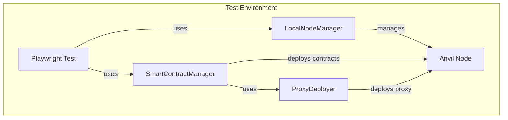
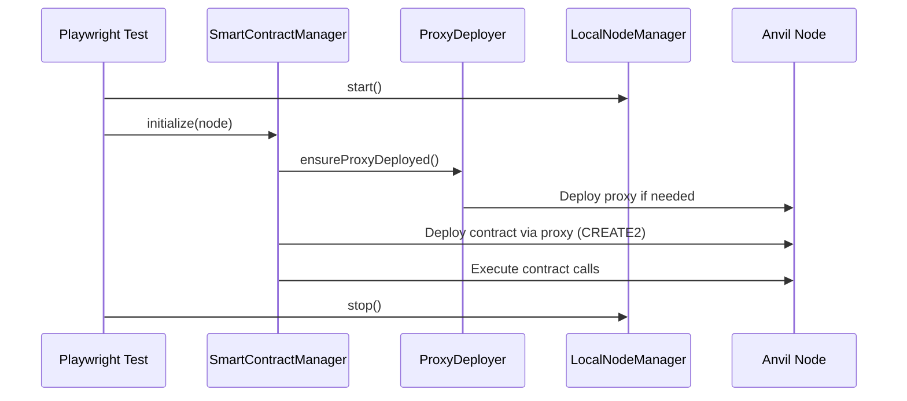

## Overview

The smart contract manager in `@coinbase/onchaintestkit` provides a robust, deterministic, and high-performance framework for deploying and interacting with Ethereum smart contracts in end-to-end (E2E) testing environments. These utilities are designed for use with local Ethereum nodes (e.g., Anvil), and leverage the [viem](https://viem.sh/) library for fast, type-safe blockchain interactions.

### Why Is This Important?

- **Deterministic Testing:** Ensures contracts are always deployed at the same address for a given salt and bytecode, making tests reproducible and reliable.
- **Performance:** Uses viem for fast, lightweight blockchain interactions, reducing test flakiness and runtime.
- **Parallelization:** Designed for parallel test execution, avoiding port and state conflicts.
- **Automation:** Automates complex setup steps, allowing focus on test logic rather than blockchain plumbing.
- **Integration:** Seamlessly integrates with Playwright and the broader `@coinbase/onchaintestkit` E2E testing ecosystem.

## Key Features

<AccordionGroup>
<Accordion title="Deterministic Contract Deployment">
  Deploy contracts at predictable addresses using the CREATE2 opcode and a deterministic deployment proxy.
</Accordion>

<Accordion title="Automated Proxy Management">
  Ensure the deterministic deployment proxy is present and deployed as needed.
</Accordion>

<Accordion title="Contract State Management">
  Deploy contracts and execute function calls as part of test setup, supporting complex test scenarios.
</Accordion>

<Accordion title="Parallel Test Safety">
  Designed to work with the `LocalNodeManager` for parallel test execution, ensuring isolated and reproducible blockchain state.
</Accordion>

<Accordion title="Artifact Integration">
  Loads contract ABIs and bytecode directly from Foundry build artifacts.
</Accordion>
</AccordionGroup>

## Architecture

<Frame>

</Frame>

## Components

### ProxyDeployer

A utility class to manage the deterministic deployment proxy contract, which enables CREATE2-based deployments at predictable addresses. The proxy ensures that contracts can be deployed to the same address across different test runs.

### SmartContractManager

A high-level manager for deploying contracts (using CREATE2), executing contract calls, and orchestrating contract state for tests. It handles the complexity of contract deployment and interaction, allowing you to focus on test logic.

## How It Works

<Frame>

</Frame>

## Use Cases

### Testing DeFi Protocols

Deploy and test complex DeFi protocols with deterministic addresses:

```typescript
await scm.setContractState({
  deployments: [
    {
      name: 'Token',
      args: ['USDC', 'USDC', 6],
      salt: generateSalt('usdc'),
      deployer: accounts[0],
    },
    {
      name: 'LiquidityPool',
      args: [tokenAddress],
      salt: generateSalt('pool'),
      deployer: accounts[0],
    },
  ],
  calls: [
    {
      target: tokenAddress,
      functionName: 'mint',
      args: [poolAddress, parseUnits('1000000', 6)],
      account: accounts[0],
    },
  ],
}, node);
```

### Testing NFT Marketplaces

Set up NFT contracts and marketplace listings:

```typescript
const nftAddress = await scm.deployContract({
  name: 'NFTCollection',
  args: ['My NFTs', 'NFT'],
  salt: generateSalt('nft'),
  deployer: artist,
});

const marketAddress = await scm.deployContract({
  name: 'Marketplace',
  args: [feeRecipient, 250], // 2.5% fee
  salt: generateSalt('market'),
  deployer: deployer,
});
```

## Best Practices

<Info>
Always use deterministic salts for reproducible tests. Consider using a salt generation function that includes test names or IDs.
</Info>

<Warning>
Remember that CREATE2 addresses depend on the bytecode. Contract upgrades or compiler changes will result in different addresses.
</Warning>

## Next Steps

<CardGroup cols={2}>
<Card title="ProxyDeployer" icon="rocket" href="/onchaintestkit/contracts/proxy-deployer">
  Learn about the deterministic deployment proxy
</Card>
<Card title="SmartContractManager" icon="code" href="/onchaintestkit/contracts/smart-contract-manager">
  Explore the contract management API
</Card>
</CardGroup> 