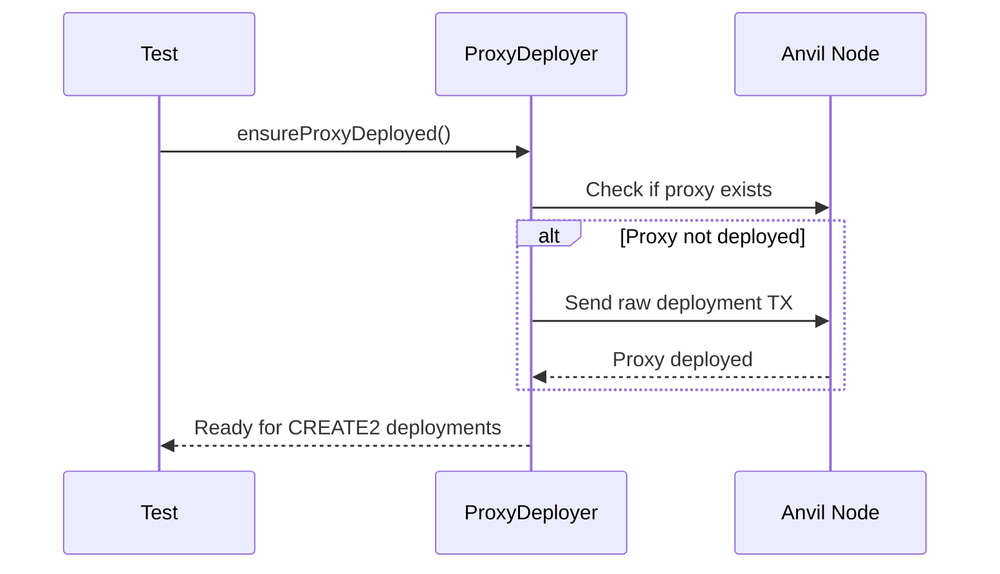

## Overview

The `ProxyDeployer` handles deployment and verification of the deterministic deployment proxy contract. This proxy is required for CREATE2-based deterministic contract deployments, ensuring that contracts can be deployed at predictable addresses across different test runs.

## Why Use ProxyDeployer?

<Info>
CREATE2 allows contracts to be deployed at deterministic addresses, but it requires a factory contract. The ProxyDeployer manages this factory (proxy) contract, which is deployed at a fixed address across all networks.
</Info>

## Constructor

```typescript
new ProxyDeployer(node: LocalNodeManager)
```

Creates a new ProxyDeployer instance.

<ParamField path="node" type="LocalNodeManager" required>
  The local Ethereum node manager instance
</ParamField>

## Properties

<ParamField path="PROXY_ADDRESS" type="Address" static>
  The fixed address at which the proxy is deployed: `0x4e59b44847b379578588920cA78FbF26c0B4956C`
</ParamField>

<ParamField path="PROXY_DEPLOYMENT_TX" type="string" static>
  Raw transaction data for deploying the proxy
</ParamField>

<ParamField path="publicClient" type="PublicClient">
  viem public client for interacting with the node
</ParamField>

<ParamField path="rpcUrl" type="string">
  RPC URL of the local node
</ParamField>

## Methods

### isProxyDeployed()

```typescript
async isProxyDeployed(): Promise<boolean>
```

Checks if the deterministic deployment proxy is already deployed.

**Returns:** `true` if the proxy is deployed, `false` otherwise

**Example:**
```typescript
const isDeployed = await proxyDeployer.isProxyDeployed();
if (!isDeployed) {
  console.log('Proxy needs to be deployed');
}
```

### ensureProxyDeployed()

```typescript
async ensureProxyDeployed(): Promise<void>
```

Deploys the proxy if not already present. This method is idempotent - it's safe to call multiple times.

**Example:**
```typescript
await proxyDeployer.ensureProxyDeployed();
// Proxy is now guaranteed to be deployed
```

### getProxyAddress()

```typescript
getProxyAddress(): Address
```

Returns the address of the deterministic deployment proxy.

**Returns:** The proxy address (`0x4e59b44847b379578588920cA78FbF26c0B4956C`)

**Example:**
```typescript
const proxyAddress = proxyDeployer.getProxyAddress();
console.log(`Proxy deployed at: ${proxyAddress}`);
```

## How It Works

The ProxyDeployer uses a pre-signed transaction to deploy the deterministic deployment proxy. This ensures that:

1. The proxy is always deployed at the same address
2. No private keys are needed for deployment
3. The deployment is deterministic across all networks

### Deployment Process

<Frame>

</Frame>

## Technical Details

### Proxy Contract

The deterministic deployment proxy is a minimal contract that enables CREATE2 deployments. It's based on [this method](https://github.com/Arachnid/deterministic-deployment-proxy) for deterministic contract deployment.

### Fixed Address

The proxy is always deployed at `0x4e59b44847b379578588920cA78FbF26c0B4956C` across all EVM-compatible chains. This address is derived from:
- A specific deployer address
- A zero nonce
- The proxy's bytecode

## Best Practices

<Tip>
Always ensure the proxy is deployed before attempting CREATE2 deployments. The `SmartContractManager` handles this automatically.
</Tip>

<Warning>
Don't attempt to deploy contracts via CREATE2 without the proxy. It will fail with an error.
</Warning>

## See Also

- [SmartContractManager](/onchaintestkit/contracts/smart-contract-manager) - High-level contract management
- [LocalNodeManager](/onchaintestkit/node/overview) - Node management for testing
- [CREATE2 Opcode](https://eips.ethereum.org/EIPS/eip-1014) - EIP-1014 specification 