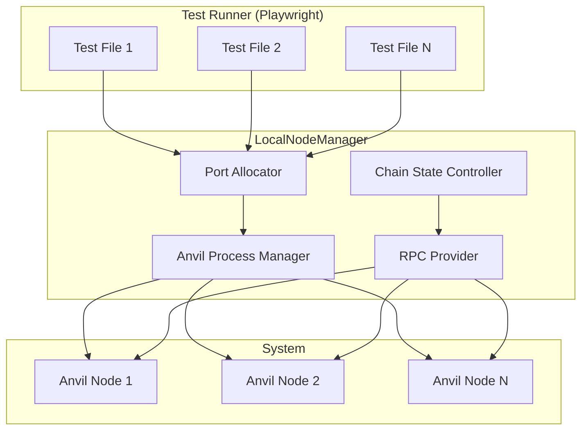

## Overview

The `LocalNodeManager` is a core utility of the [`@coinbase/onchaintestkit`](https://www.npmjs.com/package/@coinbase/onchaintestkit) package, providing robust, programmatic control over local Ethereum (Anvil) nodes for end-to-end blockchain application testing. It is designed for seamless integration with Playwright and supports advanced scenarios such as parallel test execution, dynamic port allocation, chain state manipulation, and account impersonation.

### Why is this important?

Testing blockchain applications often requires fine-grained control over the blockchain state, fast resets, and the ability to run multiple isolated nodes in parallel. `LocalNodeManager` abstracts away the complexity of managing Anvil nodes, enabling reliable, reproducible, and scalable test environments for dApps, smart contracts, and wallet integrations.

## Architecture

<Frame>

</Frame>

## Quick Start

```typescript
import { LocalNodeManager } from '@coinbase/onchaintestkit'
import { baseSepolia } from 'viem/chains'

// Create a node manager with automatic port allocation
const node = new LocalNodeManager({
    chainId: baseSepolia.id,
    forkUrl: process.env.E2E_TEST_FORK_URL,
    forkBlockNumber: BigInt(process.env.E2E_TEST_FORK_BLOCK_NUMBER ?? "0"),
    hardfork: "cancun",
})

// Start the node
await node.start()
console.log(`Node running on port ${node.getPort()}`)

// Manipulate chain state
const snapshotId = await node.snapshot()
// ...run tests...
await node.revert(snapshotId)

// Clean up
await node.stop()
```

## Key Features

<AccordionGroup>
<Accordion title="Dynamic Port Allocation">
  Automatically finds available ports for each node instance, enabling parallel test execution without conflicts.
</Accordion>

<Accordion title="Chain State Management">
  Take snapshots, revert to previous states, and manipulate blockchain time for comprehensive testing scenarios.
</Accordion>

<Accordion title="Account Control">
  Set balances, impersonate accounts, and manage nonces for precise test conditions.
</Accordion>

<Accordion title="Fork Mode Support">
  Fork from mainnet or testnet at specific blocks to test against real-world state.
</Accordion>

<Accordion title="Playwright Integration">
  Built-in fixtures and utilities for seamless integration with Playwright tests.
</Accordion>
</AccordionGroup>

## Common Use Cases

### Testing Smart Contracts

```typescript
const node = new LocalNodeManager({
    chainId: 31337,
    defaultBalance: parseEther("100"),
})

await node.start()

// Deploy and test contracts
const provider = new ethers.JsonRpcProvider(node.rpcUrl)
// ... deploy contracts, run tests
```

### Testing onchain Interactions

```typescript
// Fork mainnet for realistic testing
const node = new LocalNodeManager({
    chainId: 1,
    forkUrl: "https://eth-mainnet.g.alchemy.com/v2/YOUR-API-KEY",
    forkBlockNumber: 18000000n,
})

await node.start()

// Test against real mainnet state
```

### Time-Dependent Testing

```typescript
await node.start()

// Test staking rewards after 30 days
await node.increaseTime(30 * 24 * 60 * 60)

// Mine a block to apply the time change
await node.mine()
```

## Next Steps

<CardGroup cols={2}>
<Card title="Configuration" icon="gear" href="/onchaintestkit/node/configuration">
  Learn about all configuration options for LocalNodeManager
</Card>
<Card title="API Reference" icon="code" href="/onchaintestkit/node/api-reference">
  Explore the complete API with all methods and properties
</Card>
</CardGroup> 