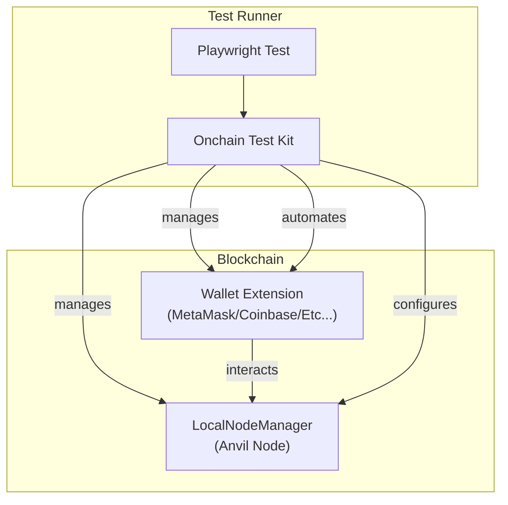

## What is OnchainTestKit?

`@coinbase/onchaintestkit` is a comprehensive, type-safe framework for end-to-end testing of blockchain applications. Built to complement OnchainKit, it provides seamless integration with Playwright for robust automation of browser-based wallet interactions, local blockchain node management, and common blockchain testing scenarios.

<CardGroup cols={2}>
<Card title="Quickstart" icon="rocket" href="/onchaintestkit/quickstart">
  Get up and running with OnchainTestKit in minutes
</Card>
<Card title="Configuration" icon="gear" href="/onchaintestkit/configuration">
  Learn how to configure wallets and networks
</Card>
<Card title="Writing Tests" icon="code" href="/onchaintestkit/writing-tests">
  Write your first blockchain tests
</Card>
<Card title="CI/CD" icon="book" href="/onchaintestkit/ci-cd">
  Integrate these in CI/CD
</Card>
</CardGroup>

<Note>
**Important**: To effectively use OnchainTestKit, we strongly recommend studying:

1. **[The main repository](https://github.com/coinbase/onchaintestkit)** - Explore the source code, understand the architecture, and see how components work together
2. **[The example tests](https://github.com/coinbase/onchaintestkit/tree/master/example/frontend/e2e)** - Real-world examples showing wallet connections, transactions, token swaps, and more

These resources contain practical patterns and best practices that will accelerate your testing implementation. The examples demonstrate common scenarios you'll encounter when testing blockchain applications.
</Note>

## Why OnchainTestKit?

Modern blockchain applications require rigorous testing of wallet interactions, transaction flows, and network behavior. Manual testing is error-prone and slow, especially when dealing with complex wallet UIs and multiple networks. OnchainTestKit automates these processes, ensuring:

- **Reliability**: Consistent test execution across environments
- **Reproducibility**: Deterministic test results
- **Scalability**: Parallel test execution support
- **Type Safety**: Full TypeScript support

## Architecture

<Frame>

</Frame>

## Key Features

<AccordionGroup>
<Accordion title="Playwright Integration">
  Automate browser-based wallet and dApp interactions with the power of Playwright's testing framework.
</Accordion>

<Accordion title="Multi-Wallet Support">
  Built-in support for MetaMask and Coinbase Wallet, with an extensible architecture for adding more wallets.
</Accordion>

<Accordion title="Smart Action Handling">
  Automate connect, transaction, signature, approval, and network switching flows with simple APIs.
</Accordion>

<Accordion title="Network Management">
  Use local Anvil nodes or remote RPC endpoints, with dynamic port allocation for parallel test execution.
</Accordion>

<Accordion title="Type Safety">
  Full TypeScript support for all configuration and test APIs, catching errors at compile time.
</Accordion>

<Accordion title="Fluent Configuration">
  Builder pattern for intuitive wallet and node setup, making configuration readable and maintainable.
</Accordion>
</AccordionGroup>

## Next Steps

<Steps>
<Step title="Install OnchainTestKit">
  Follow our [quickstart guide](/onchaintestkit/quickstart) to set up your testing environment
</Step>

<Step title="Configure Your Wallets">
  Learn how to [configure wallets](/onchaintestkit/configuration) for your test scenarios
</Step>

<Step title="Write Your First Test">
  Start [writing tests](/onchaintestkit/writing-tests) with our comprehensive guide
</Step>
</Steps> 