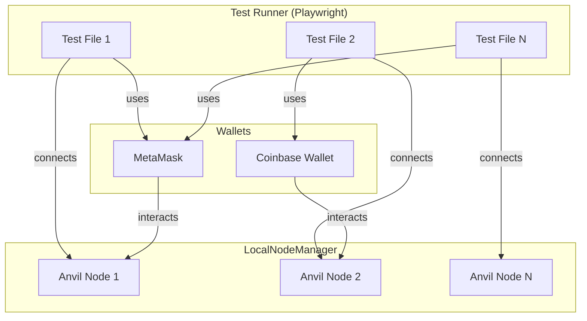
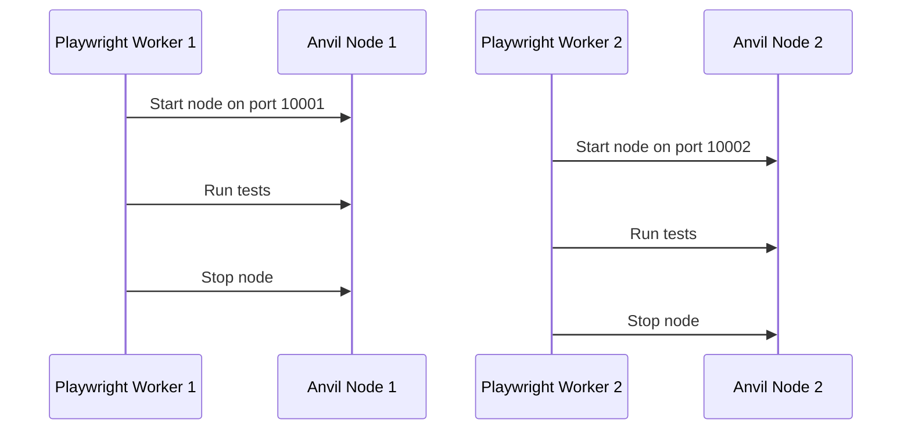

## Architecture

<Frame>

</Frame>

## Core Concepts

### 1. Wallet Abstraction

- **MetaMask** and **Coinbase Wallet** are modeled as programmable objects.
- Actions like importing wallets, switching networks, and handling notifications are exposed as high-level methods.

### 2. Local Node Management

- Each test can spin up its own local Ethereum node (Anvil) with automatic port allocation.
- Supports chain state manipulation (snapshots, reverts), time travel, and account impersonation.

### 3. Parallelization

- Designed for parallel Playwright test execution.
- Each worker gets a unique node and wallet context, avoiding cross-test interference.

<Frame>

</Frame>

## Supported Wallets

<CardGroup cols={2}>
<Card title="MetaMask" icon="fox" href="/onchaintestkit/wallets/metamask">
  Full support for MetaMask automation including account management, network switching, and transaction handling
</Card>
<Card title="Coinbase Wallet" icon="circle-c" href="/onchaintestkit/wallets/coinbase">
  Complete Coinbase Wallet support with passkey authentication and WebAuthn integration
</Card>
</CardGroup>

## Best Practices

- Always check for wallet fixture existence before running actions
- Use environment variables for sensitive data (seed phrases, passwords)
- Use Playwright's parallelization features for fast test execution
- Clean up local nodes after tests to free resources
- Use snapshots for efficient state management between test steps
- For Coinbase Wallet passkey tests, ensure proper credential management between registration and approval steps
- When testing network switching, ensure the network is already added or use the ADD_NETWORK action first

## Next Steps

<Steps>
<Step title="Quick Start">
  Follow our [Quick Start guide](/onchaintestkit/quickstart) to get up and running quickly
</Step>

<Step title="Learn Common Actions">
  Explore [common wallet actions](/onchaintestkit/wallets/common-actions) available across all wallets
</Step>

<Step title="Wallet-Specific Features">
  Dive into [MetaMask](/onchaintestkit/wallets/metamask) or [Coinbase Wallet](/onchaintestkit/wallets/coinbase) specific features
</Step>
</Steps> 